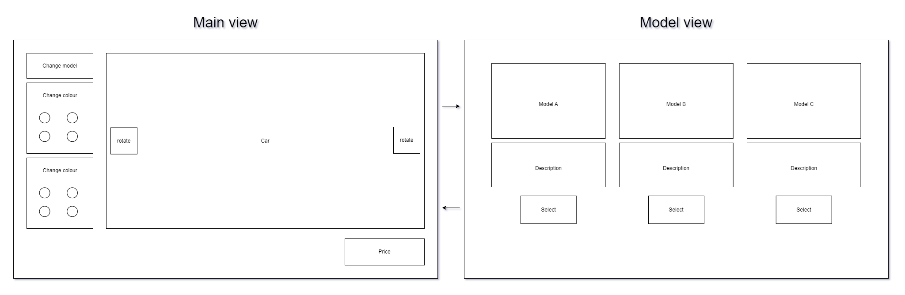
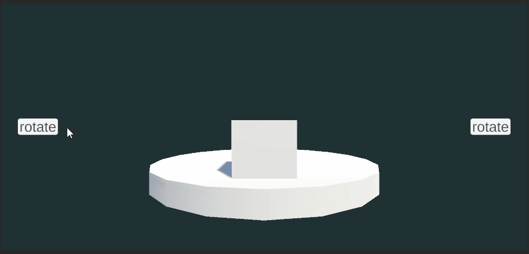
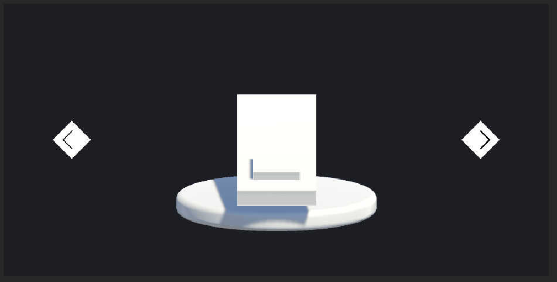
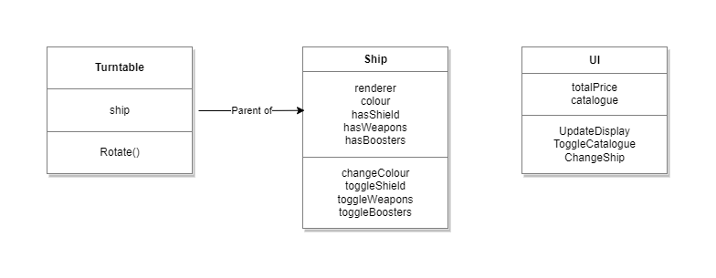
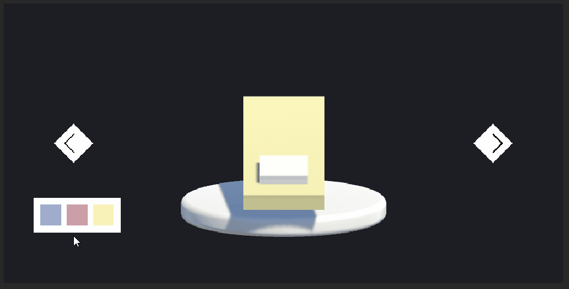
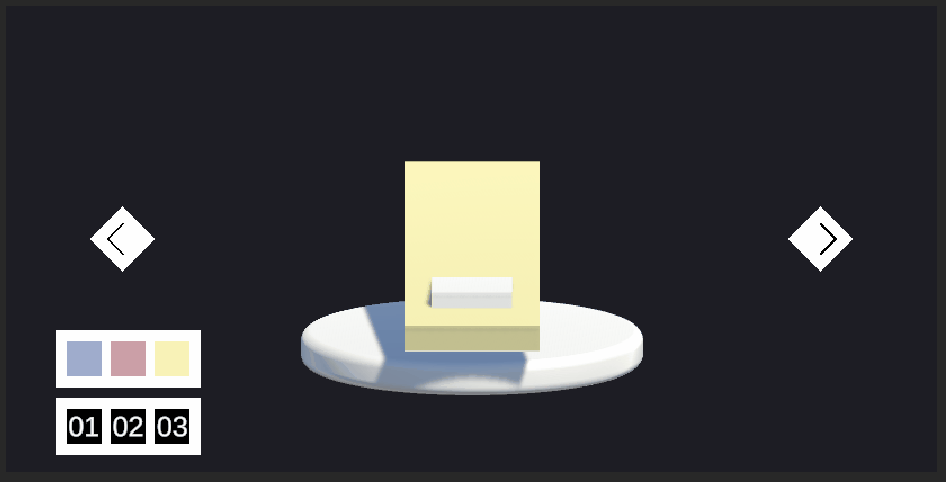
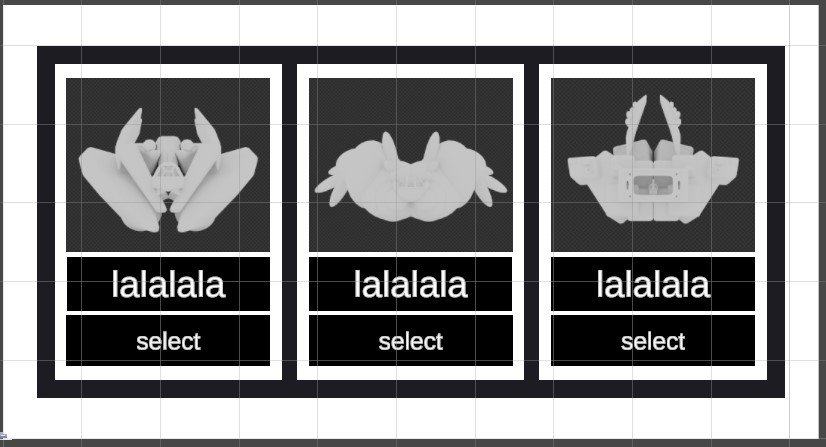

# APPROACH

## Session 001

### Minutes: 11

TODO
- Populate README with task

DONE
- Populate README with task

---

## Session 002

### Minutes: 30

TODO
- Diagram the UX

DONE
- Installed draw.io
- Rough UX layout:

---

## Session 003

### Minutes: 64

TODO
- Add a gitIgnore unity template
- Start a Unity project
- Install unity testing package
- TDD a spinning platform
    - Tut on new unity testing framework
    - Add a UI with buttons to rotate cube
    - Test right button
    - Test left button

DONE
- Add a gitIgnore unity template
- Start a Unity project
- Testing package installed by default
- Added a cube and positioned camera
- Created a canvas
- Imported TMP
- Added a UI button
- Added an assembly reference in scripts folder
- Added a PlayMode tests folder and Assembly Definition
- Added a turntable script
- Added a test asserting Turntable's RotateClockwise method increases the object's y rotation value over 0

---

## Session 004

### Minutes: 180

TODO
- Add rotate methods to turntable
- TDD ui buttons triggering rotate methods

DONE
- Added a RotateClockwise method
- Test passes
- Added an AntiClockwise test
- Test fails
- Added RotateAntiClockwise method
- Test passes
- Can't add new input system, gets namespace errors. Tried eveything I can find. Works in new project, will start again.
- Rebuilt project, error not thrown. 
- Hit another namespace error and can't get past it. Rather than spend any more time on this, I'm gong to scrap testing becuase it's leading down a massive rabbit hole time-sink that seems useless.
- Figured out how to load scenes in test so it seems less useless now.
- Started writing tests for the UI

---

## Session 005

### Minutes: 35

TODO
- TDD the clockwise button

DONE
- Wrote a test to click the button
- Got errors about MOUSE
- Added a call to TearDown after the test, reset editor
- No errors, test not passing

---

## Session 006

### Minutes: 60

TODO
- Pass test
- TDD anticlockwise button

DONE
- Button working in editor but test not passing
- Test click not firing button
- Test was simulating mouse movement but not working
- Swapped mouse sim for straight button onclick invoke

---

## Session 007

### Minutes: 80

TODO
- TDD holding the button to spin instead of click to move 1 degree

DONE
- Removed unused IFixture references
- Added test triggering a pointerDown event
- Test failing
- Added a pointerDown event trigger on button
- Added a bool that calls rotate when on
- PointerDown makes bool true
- Test passes
- Updated test to check for pointer leaving stopping rotation
- test fails
- Added event triggers for pointer up and exit
- test passes
- Added tests for rotating anticlockwise
- Tests failing
- Added event triggers and methods switching bool
- Tests pass

---

## Session 008

### Minutes: 25

TODO
- Styling

DONE
- Imported turntable
- Imported font
- Set camera to orthographic
- Set background to solid colour
- hover animation to ship
- swapped button text for arrows

---

## Session 009

### Minutes: 70

TODO
- Domain modelling
    - Ship (body, shield, boosters, weapons)
    - UI (ship catalogue popup, options buttons, price display)
- TDD ship colour

DONE
- Domain model

- Added a test for changing colour
- Passing test
- Extend test, failing
- Added a list of colours on Ship
- Ship has a method to change colour of Body renderer
- tests passing

---

## Session 009

### Minutes: 35

TODO
- TDD the colour change UI

DONE
- Added a test
- Test failed
- Added buttons
- Test passes
- Changed buttons to have listener added by script instead of trigger assigned in editor

---

## Session 010

### Minutes: 75

TODO
- TDD the ship swap logic
- TDD the ship swap UI

DONE
- Testing turntable change ship method by checking ship base name
- Made ship prefabs, in a list on turntable
- Tests passing
- Testing UI buttons changing ship
- Test failing
- Added buttons with scripts to trigger turntable
- Tests passing
- Colours doesn't stay when changing ship models
- TDD for colour persistence, buttons trigger methods on turntable instead

- Updated domain diagram

---

## Session 011

### Minutes: 50 

TODO
- TDD Ship catalogue UI

DONE
- Test looking for button to open window and check window is not null
- Window added with button that activates
- Test to close window by selecting ship model
- Window closes, test passing

- Had to do more setup in old tests

---

## Session 012

### Minutes: 30 

TODO
- Styling of models window

DONE
- Temp styling of models window

